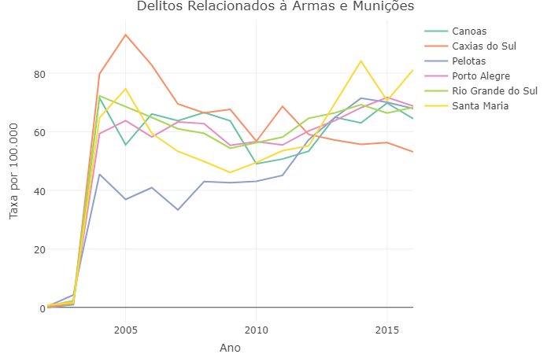

```{r setup, echo = FALSE, warning=FALSE, message=FALSE, include=FALSE}
knitr::opts_chunk$set(echo = TRUE, fig.pos = 'H')
library(knitr)
library(rgdal)
library(spdep)
library(pander)
library(xtable)
library(tidyverse) # Tem muitos pacotes como ggplo2, tidyr...
#library(ggplot2)
#library(tidyr) # Função gather

library(stringr) # str_pad function
library(rdrobust)
library(rdd) # Discontinuity regressions
library(KernSmooth) # Função locpoly
library(lubridate) # Para lidar com datas
library(gam)
#mapa_rs <- readOGR("C:/Users/renan/Desktop/Projeto Tese/Shapes", "43mu2500gsd", encoding='UTF-8', verbose=FALSE)
mapa_rs <- readOGR("C:/Users/Windows 8.1/Desktop/Projeto Tese/Shapes", "43mu2500gsd", encoding='UTF-8', verbose=FALSE)
#mapa_rs_pre <- readOGR("C:/Users/renan/Desktop/Projeto Tese/Shapes", "43mu2500gsd", encoding='UTF-8', verbose=FALSE)
mapa_rs_pre <- readOGR("C:/Users/Windows 8.1/Desktop/Projeto Tese/Shapes", "43mu2500gsd", encoding='UTF-8', verbose=FALSE)
#setwd("C:/Users/renan/Desktop/Projeto Tese")
setwd("C:/Users/Windows 8.1/Desktop/Projeto Tese")
```


# Crimes nos municípios gaúchos: análise de um índice geral de criminalidade

## Introdução
### Introdução

- A criminalidade e a sensação de insegurança diminui o bem-estar de população residente de um determinado local.
\bigskip
- O avanço de métodos de mensuração deste fenômeno são justificados.
\bigskip
- Problemas: alta volatilidade em taxas de municípios pequenos e alta probabilidade de não se observar o evento.

### Introdução
- @carvalho2012saude: taxa de homicídios em Nova Marilândia (MT) em 2008 foi de 211,1^[Mais de 3 vezes maior do que a do país com maior taxa de homicídio do mundo], sendo que este município tinha 2.369 habitantes e teve 5 homicídios.
\bigskip
- Problema amplamente discutido na literatura epidemiológica (@clayton1987biometrics, @marshall1991journalserieC, @pringle1996ecosoc e @catelan2010biomj).
\bigskip
- Possível solução: estimativas bayesianas.

## Metodologia
### Metodologia

- Os métodos empregados se diferem pois farão uso da estrutura espacial com diferentes especificações.
\bigskip
- Fará uso de métodos bayesianos hierárquicos.
\bigskip
- Literatura sobre o tema de estatística e econometria espacial pode ser encontrada em @besag1974, @lesage1997irsr, @lesage1999econometrics, @banerjee2004hierarchical e @bivand2008spatialwithR.


### Matrizes de Vizinhança
- Quatro diferentes tipos de estrutura espacial:
```{r echo=FALSE, warning=FALSE, message=FALSE, fig.cap = "Exemplo de Diferentes Especificações. (a) Vizinhos de contiguidade de 1ª ordem. (b) Knn de 1ª ordem. (c) Knn de 2ª ordem. (d) Knn de 3ª ordem.\\label{fig:tipos_graf}", fig.height = 5, fig.height = 5}


df_tx_mun_pre <- read.csv("DadosMunTxEnsaio2.csv", header=T, sep=";", dec=",")
df_tx_mun <- df_tx_mun_pre[df_tx_mun_pre$Mun != "Pinto Bandeira",] # Retira Pinto Bandeira

crimes <- c("Roub", "RoubVei", "Latro", "Furt", "HomDol", "FurtVei", "ExtoMS") # Crimes a serem avaliados
# Roub, RoubVei, Latro, Furt, HomDol, FurtVei, ExtoMS, Exto, Este, EntTra, EntPosse, DelCorrup, DelArmMun

banco_mun_tx <- 
cbind(df_tx_mun[,1:2],
      df_tx_mun[,substring(names(df_tx_mun), first=4, last=nchar(names(df_tx_mun))-4) 
                %in% crimes])


# all.x = FALSE é para retirar os dois lagos que não são municípios
mapa_rs <- merge(mapa_rs_pre, banco_mun_tx, by.x = "GEOCODIG_M", by.y="CodIBGE", all.x = FALSE)

# Construindo os grafos

# Contiguidade de 1ª ordem
nbrsm_c1 <- poly2nb(mapa_rs, queen = TRUE) # Um ponto já é suficiente para ser ser vizinho
nbrsw_c1 <- nb2listw(nbrsm_c1) # Lista de Vizinhança padronizada

# Vizinho de 1ª ordem (o número de vizinhos é o número de ordens)
nbrsm_pre <- knearneigh(coordinates(mapa_rs), k=1) # Um ponto já é suficiente para ser ser vizinho
nbrsm_k1 <- knn2nb(nbrsm_pre)
nbrsw_k1 <- nb2listw(nbrsm_k1) # Lista de Vizinhança padronizada

# Vizinho de 2ª ordem (o número de vizinhos é o número de ordens)
nbrsm_pre <- knearneigh(coordinates(mapa_rs), k=2) # Um ponto já é suficiente para ser ser vizinho
nbrsm_k2 <- knn2nb(nbrsm_pre)
nbrsw_k2 <- nb2listw(nbrsm_k2) # Lista de Vizinhança padronizada

# Vizinho de 3ª ordem (o número de vizinhos é o número de ordens)
nbrsm_pre <- knearneigh(coordinates(mapa_rs), k=3) # Um ponto já é suficiente para ser ser vizinho
nbrsm_k3 <- knn2nb(nbrsm_pre)
nbrsw_k3 <- nb2listw(nbrsm_k3) # Lista de Vizinhança padronizada

# Gráfico de ilustrações das 4 especificações de grafos!
par(mfrow=c(2,2), mar=c(1,1,2,1), oma=c(0,0,0,0))
plot(mapa_rs, border="grey", main="(a)")
plot(nbrsm_c1, coordinates(mapa_rs), add=TRUE, cex=0.1)

plot(mapa_rs, border="grey", main="(b)")
plot(nbrsm_k1, coordinates(mapa_rs), add=TRUE, cex=0.1)

plot(mapa_rs, border="grey", main="(c)")
plot(nbrsm_k2, coordinates(mapa_rs), add=TRUE, cex=0.1)

plot(mapa_rs, border="grey", main="(d)")
plot(nbrsm_k3, coordinates(mapa_rs), add=TRUE, cex=0.1)
```

### Modelos Autoregressivos Condicionais
- Os modelos CAR (@besag1974), considerando \textit{n} áreas de uma variável aleatória $\boldsymbol{x}=(x_1,...x_n)$, cada uma caracterizada por um grupo de vizinhos $N_{(i)}$, assume-se que $x_i$ segue a seguinte distribuição:
$$
x_i|\boldsymbol{x}_{-i}\sim Normal\left ( \mu_i+\sum_{j=1}^{n}r_{ij}\left ( x_j-\mu_j \right ),s_{i}^{2} \right )
$$
onde $\mu_j$ é a média da área $j$ e $s_{i}^{2} = \sigma_{x}^{2}/N_i$ é a variância da área $i$ que depende do número de vizinhos ($N_i=\#N_{(i)}$) o que faz com que a medida que o número de vizinhos da área $i$ aumente, sua variância diminua.

### Modelos Autoregressivos Condicionais
- A distribuição da ocorência de crimes possui a verossimilhança Poisson:
$$
y_i|\lambda_i\sim Poisson(\lambda_i)
$$
onde a média $\lambda_i$ é definida em termos da taxa de risco $\rho_i$ e o número esperado de ocorrências $E_i$ onde $\lambda_i=\rho_i\times E_i$. Neste caso, o preditor linear adquire a seguinte forma
$$
\eta_i = \log (\rho_i)=\alpha + u_i
$$
onde o efeito aleatório $u_i$ segue uma especificação estruturada CAR.

### Modelos Autoregressivos Condicionais
- Modelo alternativo utilizado ($BYM$):
$$
\eta_i = \log (\rho_i)=\alpha + u_i + \varepsilon_i
$$
onde o efeito aleatório $u_i$ também segue CAR e o termo $\varepsilon_i$ segue um termo não estruturado $\varepsilon_i \sim Normal\left ( 0,\sigma_{\varepsilon}^{2} \right )$

### Integrated Nested Laplace Approximation
- \textit{Integrated Nested Laplace Approximation} (INLA) é uma recente abordagem de estimação Bayesiana (@rue2009approximate)
\bigskip
- Não necessita de simulações estocásticas (como MCMC ou Gibbs), pois faz aproximações analíticas das distribuições a posteriori.
\bigskip
 - Usado em Modelos Gaussianos Latentes.


### Agregação do Índice

- Ponderações pelo menor valor de pena prevista
$$
ICrimeRS_i=\frac{\sum_{j=1}^{k}y_{ij}\times w_j}{População_i} \times 365
$$
onde a variável \textit{j} é o indexador de tipo de crime (que varia de 1 até \textit{k}), \textit{y} é a quantidade de ocorrência criminal e \textit{w} é o pena mínima prevista em lei.

- Interpretação prática: \textit{"Supondo que todos os crimes sejam julgados e condenados pela pena mínima, em Porto Alegre, quantos dias do ano cada habitante Porto Alegrense teria que passar na cadeia para pagar por todos os crimes cometidos?"}.

## Resultados

### Modelos Estimados
- Modelo Besag:
$$
\begin{aligned}
y_i|\lambda_i & \sim Poisson(\lambda_i)\\
\lambda_i & =\rho_i\times E_i\\
\eta_i & =\log (\rho_i)=\alpha + u_i\\
u_i & \sim Besag\
\end{aligned}
$$

### Modelos Estimados
- Modelo BYM:
$$
\begin{aligned}
y_i|\lambda_i & \sim Poisson(\lambda_i)\\
\lambda_i & =\rho_i\times E_i\\
\eta_i & =\log (\rho_i)=\alpha + u_i + \varepsilon_{i}\\
u_i & \sim Besag\\
\varepsilon_{i} & \sim Normal(0,\tau)\
\end{aligned}
$$

### Modelos Estimados
- Modelo Besag com efeito temporal de primeira ordem (RW1):
$$
\begin{aligned}
y_i|\lambda_i & \sim Poisson(\lambda_i)\\
\lambda_i & =\rho_i\times E_i\\
\eta_i & =\log (\rho_i)=\alpha + \theta_t + u_i\\
\theta_t & =\theta_{t-1} + \epsilon_i\\
u_i & \sim Besag\\
\epsilon_i & \sim Normal(0,\tau)\
\end{aligned}
$$

### Modelos Estimados
- Modelo BYM com efeito temporal de primeira ordem (RW1):
$$
\begin{aligned}
y_i|\lambda_i & \sim Poisson(\lambda_i)\\
\lambda_i & =\rho_i\times E_i\\
\eta_i & =\log (\rho_i)=\alpha + \theta_t + u_i + \varepsilon_i\\
\theta_t & =\theta_{t-1} + \epsilon_i\\
u_i & \sim Besag\\
\varepsilon_i & \sim Normal(0,\tau)\\
\epsilon_i & \sim Normal(0,\tau)\
\end{aligned}
$$

### Modelos Estimados
- Distribuições \textit{a priori} $1/\sigma ^{2}=\tau \sim Gama(1;0,0005)$^[$X \sim Gama(\alpha;\beta) \Rightarrow E(X)=\alpha/\beta$.]
\bigskip
- Os modelos escolhidos fazedo uso do *Deviance Information Criteria* (DIC) (@gelfandBS1992 e @deyBio1997) e do *Conditional Predictive Ordinate* (CPO) (@spiegelhalter2002) através do *Logarithm of Pseudo Marginal Likelihood* (LPML). 

### Modelos - Resultados LPML
\begin{table}[H]
\begin{tiny}
\begin{center}
\begin{tiny}
\caption{LPML para diferentes especificações e diferentes matrizes}
\label{tab:LPML}
\centering
\begin{tabular}{llrrrrrrr}
  \hline
Matriz & Especificação & Roubo & RouboVei & Latro & Furto & HomDol & FurtVei & ExtoMS \\ 
  \hline
Cont. (1ª) & Besag & 25419.99 & 11742.86 & 2075.90 & 52413.51 & 8021.24 & 22301.31 & 590.16 \\ 
Cont. (1ª) & BYM & \textbf{\textcolor{red}{25419.01}} & \textbf{\textcolor{red}{11741.85}} & \textbf{\textcolor{red}{2075.66}} & 52413.63 & \textbf{\textcolor{red}{8020.62}} & 22300.33 & \textbf{\textcolor{red}{590.16}} \\ 
Cont. (1ª) & Besag + RW1 & 25444.43 & 11805.33 & 2076.24 & 52368.41 & 8023.76 & 22237.35 & 590.21 \\ 
Cont. (1ª) & BYM + RW1 & 25442.21 & 11800.29 & 2076.03 & 52370.02 & 8023.52 & \textbf{\textcolor{red}{22234.19}} & 590.22 \\ 
Knn (1ª) & Besag & 29184.34 & 17460.42 & 2147.53 & 52415.55 & 9527.48 & 24611.89 & 623.52 \\ 
Knn (1ª) & BYM & 28735.78 & 16916.85 & 2134.61 & 52541.77 & 9338.64 & 24262.77 & 616.78 \\ 
Knn (1ª) & Besag + RW1 & 29194.09 & 17558.20 & 2147.76 & 52370.63 & 9520.94 & 24517.45 & 623.59 \\ 
Knn (1ª) & BYM + RW1 & 28744.92 & 16983.56 & 2134.44 & 52475.20 & 9336.73 & 24143.70 & 618.19 \\ 
Knn (2ª) & Besag & 25425.73 & 12376.43 & 2155.34 & 52413.47 & 9601.24 & 22312.34 & 625.27 \\ 
Knn (2ª) & BYM & 116942.77 & 58923.96 & 2170.16 & 88132.22 & 10244.07 & 49997.24 & 626.30 \\ 
Knn (2ª) & Besag + RW1 & 25449.27 & 12437.28 & 2155.35 & 52370.74 & 9598.03 & 22368.72 & 625.27 \\ 
Knn (2ª) & BYM + RW1 & 28318.18 & 33458.38 & 2170.29 & 56544.52 & 10263.77 & 33539.89 & 626.30 \\ 
Knn (3ª) & Besag & 25423.06 & 12342.54 & 2157.44 & 52412.85 & 8726.26 & 22305.15 & 624.44 \\ 
Knn (3ª) & BYM & 116979.91 & 58353.86 & 2172.73 & 90182.97 & 10329.64 & 49515.16 & 626.32 \\ 
Knn (3ª) & Besag + RW1 & 25447.32 & 12412.15 & 2157.35 & \textbf{\textcolor{red}{52368.22}} & 8699.60 & 22241.59 & 624.59 \\ 
Knn (3ª) & BYM + RW1 & 25565.82 & 33097.15 & 2172.89 & 56663.46 & 10369.80 & 33618.43 & 626.37 \\ 
   \hline
\multicolumn{9}{l}{Fonte: Elaboração própria.}
\end{tabular}
\end{tiny}
\end{center}
\end{tiny}
\end{table}

### Modelos - Resultados DIC
\begin{table}[H]
\begin{center}
\begin{tiny}
\caption{DIC para diferentes especificações e diferentes matrizes}
\label{tab:DIC}
\centering
\begin{tabular}{llrrrrrrr}
  \hline
Matriz & Especificação & Roubo & RouboVei & Latro & Furto & HomDol & FurtVei & ExtoMS \\ 
  \hline
Cont. (1ª) & Besag & 49748.71 & 22952.88 & 4150.39 & 100654.70 & 15975.00 & 44451.91 & 1179.17 \\ 
Cont. (1ª) & BYM & \textbf{\textcolor{red}{49746.27}} & \textbf{\textcolor{red}{22949.99}} & \textbf{\textcolor{red}{4149.81}} & 100654.47 & \textbf{\textcolor{red}{15973.04}} & \textcolor{red}{44448.67} & \textbf{\textcolor{red}{1179.15}} \\ 
Cont. (1ª) & Besag + RW1 & 49690.41 & 22947.45 & 4151.02 & 100477.84 & 15977.64 & 44462.45 & 1179.24 \\ 
Cont. (1ª) & BYM + RW1 & \textcolor{red}{49688.18} & \textcolor{red}{22944.77} & 4150.55 & 100478.17 & 15977.30 & \textbf{\textcolor{red}{44458.96}} & 1179.24 \\ 
Knn (1ª) & Besag & 57239.63 & 34319.00 & 4294.40 & 100663.69 & 19005.37 & 49155.42 & 1246.90 \\ 
Knn (1ª) & BYM & 56362.48 & 33239.63 & 4269.43 & 100983.19 & 18632.38 & 48445.20 & 1233.44 \\ 
Knn (1ª) & Besag + RW1 & 57165.47 & 34294.24 & 4294.73 & 100496.22 & 18990.73 & 49141.97 & 1247.01 \\ 
Knn (1ª) & BYM + RW1 & 56295.99 & 33190.24 & 4269.00 & 100767.21 & 18627.23 & 48408.08 & 1236.17 \\ 
Knn (2ª) & Besag & 49772.66 & 24302.50 & 4309.83 & 100657.15 & 19152.10 & 44485.44 & 1250.52 \\ 
Knn (2ª) & BYM & 231142.70 & 116952.17 & 4339.80 & 171989.60 & 20455.88 & 99960.90 & 1252.56 \\ 
Knn (2ª) & Besag + RW1 & 49714.19 & 24279.69 & 4309.76 & 100478.71 & 19144.05 & 44785.79 & 1250.50 \\ 
Knn (2ª) & BYM + RW1 & 55449.86 & 65740.68 & 4340.06 & 108971.87 & 20493.95 & 67182.64 & 1252.56 \\ 
Knn (3ª) & Besag & 49768.63 & 24236.07 & 4313.94 & 100656.60 & 17403.92 & 44472.25 & 1248.83 \\ 
Knn (3ª) & BYM & 231313.12 & 115829.00 & 4345.05 & 175962.87 & 20625.67 & 99200.93 & 1252.61 \\ 
Knn (3ª) & Besag + RW1 & 49710.14 & 24229.56 & 4313.71 & \textbf{\textcolor{red}{100479.81}} & 17349.44 & 44482.71 & 1249.10 \\ 
Knn (3ª) & BYM + RW1 & 49996.59 & 65035.74 & 4345.36 & 109202.52 & 20705.62 & 67400.28 & 1252.72 \\ 
   \hline
\multicolumn{9}{l}{Fonte: Elaboração própria.}
\end{tabular}
\end{tiny}
\end{center}
\end{table}


### Estimativas INLA

- Sobresuavização das estimativas.
\bigskip
- Dois terços de seu peso para os valores estimados e um terço para os valores brutos como \textit{proxy} das ocorrências.
\bigskip
- A volatilidade não é eliminada, mas existe uma suavização dos seus valores, bem como a presença de valores não-nulos quando o número de ocorrências é zero.

### Estimativas INLA
```{r echo=FALSE, warning=FALSE, message=FALSE, fig.cap = "Comparação de Número de Homicídios de municípios selecionados\\label{fig:compara_homdol_muni_selecionados}", fig.height = 4, fig.align='center'}
load("Estimativas_de_Ocorrencia_modelos.Rdata")
load("bases_para_estimar_y.Rdata")

corresp <- readRDS("Corresp_Mun_PopRS.rds")
corresp$CodIBGE <- as.factor(corresp$CodIBGE) # Para pode 'joinear' depois
corresp_aux <- corresp %>% select(CodIBGE, Cidade)

base_aux <- tbl_df(base_roubo)
base_aux2 <- base_aux %>%
  select(GEOCODIG_M, Ano, Pop, i) %>%
  mutate(Roubo_INLA = yhat_roubo_m.bym.c1,     Roubo_Bruto = base_roubo$y,
         RouboVei_INLA = yhat_roubovei_m.bym.c1,   RouboVei_Bruto = base_roubovei$y,
         Latro_INLA = yhat_latro_m.bym.c1,          Latro_Bruto = base_latro$y,
         Furto_INLA = yhat_furt_m.bes.rw.k3,        Furto_Bruto = base_furt$y,
         HomDol_INLA = yhat_homdol_m.bym.c1,       HomDol_Bruto = base_homdol$y,
         FurtoVei_INLA = yhat_furtvei_m.bym.rw.c1, FurtoVei_Bruto = base_furtvei$y,
         Exto_INLA = yhat_extoms_m.bym.c1     , Exto_Bruto = base_extoms$y) %>%
  left_join(corresp_aux, by = c("GEOCODIG_M" = "CodIBGE"))

# Gráfico comparativo Bruto vs. INLA
aux_1 <- base_aux2 %>%
  gather(Tipo, Valor_INLA, Roubo_INLA, RouboVei_INLA, Latro_INLA, Furto_INLA, HomDol_INLA, FurtoVei_INLA, Exto_INLA) %>%
  select(Tipo, Valor_INLA)

aux_2 <- base_aux2 %>% # Direita
  gather(Tipo2, Valor_Bruto, Roubo_Bruto, RouboVei_Bruto, Latro_Bruto, Furto_Bruto, HomDol_Bruto, FurtoVei_Bruto, Exto_Bruto) %>%
  select(Tipo2, Valor_Bruto)

aux3 <- bind_cols(aux_1, aux_2) %>% separate(col = Tipo, into = c("Crime", "Método"), sep="_") %>%
        select(Crime, Valor_INLA, Valor_Bruto)


w_INLA <- 2
w_Bruto <- 1
ww <- w_INLA + w_Bruto

# Calculando o número de ocorrências combinando INLA e o dado bruto
base_aux3 <- base_aux2 %>%
             mutate(Roubo_O = (Roubo_INLA * w_INLA + Roubo_Bruto * w_Bruto) / ww,
                    RouboVei_O = (RouboVei_INLA * w_INLA + RouboVei_Bruto * w_Bruto) / ww,
                    Latro_O = (Latro_INLA * w_INLA + Latro_Bruto * w_Bruto) / ww,
                    Furto_O = (Furto_INLA * w_INLA + Furto_Bruto * w_Bruto) / ww,
                    HomDol_O = (HomDol_INLA * w_INLA + HomDol_Bruto * w_Bruto) / ww,
                    FurtoVei_O = (FurtoVei_INLA * w_INLA + FurtoVei_Bruto * w_Bruto) / ww,
                    Exto_O = (Exto_INLA * w_INLA + Exto_Bruto * w_Bruto) / ww) %>%
             select(GEOCODIG_M, Ano, Pop, i, Cidade, Roubo_O, RouboVei_O, Latro_O, Furto_O, HomDol_O, FurtoVei_O, Exto_O,
                    HomDol_Bruto, Latro_Bruto)


# Homicídio: Esmeralda, São José do Herval,São José do Inhacorá

cid_hom <- c("PELOTAS", "ESMERALDA", "SAO JOSE DO HERVAL", "SAO JOSE DO INHACORA")
aux <- base_aux3 %>% filter(Cidade %in% cid_hom) %>% gather(Tipo, Quantidade, HomDol_O, HomDol_Bruto)
ggplot(aux, aes(x = Ano+2001, y = Quantidade, col = Tipo)) + geom_line(size= 1.1) +
  facet_wrap(~ Cidade, scales="free") +
  ggtitle("Homicídios Comparativos") +
  theme(plot.title = element_text(hjust = 0.5)) +
  xlab("Anos")
```


### Construção/Resultados dos Índices
- Índices contra a vida (homicídio e latrocínio) e contra o patrimônio (demais).
\bigskip
- Porto Alegre é o município que apresenta o maior índice de criminalidade geral em 2015. 
\bigskip
- Cada Porto Alegrense deveria, em média, passar entre 49 e 50 dias dentro da cadeia neste ano para pagar por todos os crimes cometidos.
\bigskip
- Este indicador geral é composto majoritariamente por crimes contra o patrimônio.

### Construção/Resultados dos Índices
```{r echo=FALSE, warning=FALSE, message=FALSE, fig.cap = "Comparação dos índices para 10 municípios relevantes selecionados. O painel à esquerda mostra o ICrime geral, o painel central apresenta o índice contra o patrimônio e à direita o índice contra à vida.\\label{fig:indices_top10}", fig.height = 4, fig.align='center'}
base_aux4 <- base_aux3 %>%
             mutate(Numerador = Roubo_O * 4 +
                                RouboVei_O * 4 +
                                Latro_O * 20 +
                                Furto_O * 1 +
                                HomDol_O  * 6 +
                                FurtoVei_O * 1 +
                                Exto_O * 8,
                    Numerador_Vida = Latro_O * 20 +
                                     HomDol_O  * 6,
                    Numerador_Patri = Roubo_O * 4 +
                                      RouboVei_O * 4 +
                                      Furto_O * 1 +
                                      FurtoVei_O * 1 +
                                      Exto_O * 8,
                    ICrime = Numerador/Pop * 365,
                    Indice_Vida = Numerador_Vida/Pop * 365,
                    Indice_Patri = Numerador_Patri/Pop * 365) %>% # Interpretação do indicador: Número de Dias esperado que cada habitante teria que pagar por ano caso todos fossem condenados a pena mínima
              select(GEOCODIG_M, Ano, Pop, i, Cidade, ICrime, Indice_Vida, Indice_Patri)

# TOP 10 CIDADES #
cidades <- c("PORTO ALEGRE", "CAXIAS DO SUL", "CANOAS", "PELOTAS", "SANTA MARIA", "GRAVATAI", "VIAMAO", "NOVO HAMBURGO", "SAO LEOPOLDO", "ALVORADA")
tb <- base_aux4 %>% filter(Cidade %in% cidades)

tb_top_10 <- gather(tb, Tipo_Indice, Valor, ICrime, Indice_Vida, Indice_Patri)
ggplot(tb_top_10, aes(x=Ano+2001, y = Valor, col=Cidade)) + geom_line(size=1.1) +
  facet_wrap(~Tipo_Indice, scales="free") +
  xlab("Anos") +
  theme(legend.position="bottom",
        legend.text=element_text(size=6),
        legend.title=element_blank())
```


### Construção/Resultados dos Índices
- Apesar do ICrime ter relação com o Furto, foi Porto Alegre que liderou o ranking em 2015.
\bigskip
- O município que lidera o ranking de mais perigoso em termos de crimes vitais é Alvorada, que não está presente nas cinco maiores taxas brutas de latrocínio ou de homicídio. 
\bigskip
- Esmeralda, que apresentava taxa de 91 homicídios por 100 mil habitantes, liderando o ranking, caiu para a sexta posição de crimes contra a vida em 2015. 
\bigskip
- Cidades que não apresentavam altas posições em homicídios e latrocínios, apareceram como altamente violentas, como é o caso de Porto Alegre, Vicente Dutra, Viamão e Canoas.
\bigskip
- A suavização proposta com o presente método tangibiliza o problema de variabilidade sem perder as especificidades regionais.

## Considerações Finais

### Considerações Finais
- Fácil interpretabilidade do seu resultado.
\bigskip
- Possíveis Limitações: muito afetado pelos crimes contra o patrimônio e um grau de volatilidade ainda presente.
\bigskip
- Transformação nos dados poderia ser feita, mas perderia interpretabilidade. 
\bigskip
- O índice geral refletir os crimes contra o patrimônio tem justificativa uma vez que ele busca medir a realização criminal e a sensação de insegurança.


# Daylight Saving Time and Homicides: the effect of light in crimes in RS

## Introduction
### Introduction
- According to the rational choice from @becker1968economy, the individual chooses to commit a crime if the expected benefits are greater than the expected costs.
\bigskip
- Several factors influence both incentives.
\bigskip
- Probability of being captured may play an important deterrent to crime.

### Introduction
- One of the ways to assess whether clarity affects criminal behavior is to make use of Daylight Saving Time (DST).
\bigskip
- In terms of criminality, @doleac2015 estimate a 7\% drop in robberies after the DST beginning and a 11\% reduction in rapes.

### Introduction
- In Brazil, @toro2016 estimated that the change in ambient light caused by the DST was responsible for saving about 3,850 potential victims from 2006 to 2011.
\bigskip
- Specificities: analysis of a single state, intra-annual models, inclusion of climate covariates and effects of the beginning and end of the DST.

## Methodology
### Data Source
- \textit{Mortality Information System} (SIM) has mortality information at the municipal level, including date and time of death.
\bigskip
- Cause of death through the codes of the International Statistical Classification of Diseases and Related Health Problems (ICD-10).

\begin{table}[H]
\begin{tiny}
\caption{Code description of ICD-10 used}
\begin{center}
\begin{tabular}{cl} % Isto diz respeito a centralização ou justificação à esquerda/direita de cada coluna
\hline 
Code & Description\\
\hline 
X93 & Assault by handgun discharge\tabularnewline
X94 & Assault by rifle, shotgun and larger firearm discharge\tabularnewline
X95 & Assault by other and unspecified firearm discharge\tabularnewline
X99 & Assault by sharp object\tabularnewline
Y00 & Assault by blunt object\tabularnewline
Y22 & Handgun discharge, undetermined intent\tabularnewline
Y23 & Rifle, shotgun and larger firearm discharge, undetermined intent\tabularnewline
Y24 & Other and unspecified firearm discharge, undetermined intent\tabularnewline
\hline
\multicolumn{2}{l}{Source: Elaborated by the author.}
\end{tabular}
\end{center}
\label{tab:cid10}
\end{tiny}
\end{table}

- National Institute of Meteorology (INMET) has daily public weather data for municipalities in RS.

### Regression Discontinuity Design (RDD)
```{r echo=FALSE, warning=FALSE, message=FALSE, cache=FALSE, results='asis'}
x1 <- seq(-3, 0, by=0.1)
y1 <- rep(0,length(x1))
plot(x1,y1,type="l", xlim=c(-3,3), ylim=c(0,1), 
     lwd=2, cex.axis=0.75, xlab="No. of days centered in the intervention", ylab="P(T=1)")
x2 <- seq(0, 3, by=0.1)
y2 <- rep(1,length(x2))
lines(x2,y2,lwd=2)
abline(v=0, lty=2)
arrows(-0.5, 0.2, x1 = -0.05, y1 = 0.05, length = 0.1)
text(-0.95, 0.3, "Intervention Moment", cex=0.65)
```

### Regression Discontinuity Design (RDD)
- The equation below presents the model in its reduced form
\begin{align*}
Y_{da}=\beta_{0} + \tau I(T_{da}\geq 0)+g(T_{da})+X_{da}\beta + \varepsilon_{da}
\label{eq:mod_rdd}
\end{align*}

- $d$: nº of days after DST
- $a$: year
- $T_{da}$: horizontal axis variable
- $X_{da}$: vector of covariates
- $g(\cdot)$: nonparametric flexible function
- $Y_{da}$: homicide rate per 100,000 inhabitants
\bigskip
- Particular case of Generalized Additive Models (GAM).

### Data Preparation
- Clocks must be advanced by one hour at start of DST, this could underestimate the number of homicide cases on the day immediately following the change in DST.
\bigskip
- The number of homicides occurring on this day is multiplied by 24/23 and when DST is terminated the number of deaths of the immediately subsequent day is multiplied by 23/24.


## Results
### Start of DST
- Complete model fitted (with covariates):
\bigskip
\begin{tiny}
\begin{equation*}
HR_{da}=\beta_{0}+\tau I(T_{da}\geq 0)+g(T_{da})+\beta_{1}Temp_{da}+\beta_{2}Prec_{da}+\beta_{3}Wind_{da} + \beta_{k}Day_{dak} + \varepsilon_{da}
\end{equation*}
\end{tiny}
\bigskip
- Previous discontinuity between climate covariates: in general, lack of significance.
\bigskip
- In all years and models it was observed a high absence of significance with the exception for the model with no covariates in 2007 (Sig. = 0.0300), with **an opposite direction than expected** ($\tau = 0.0195$).

### Start of DST
```{r echo=FALSE, warning=FALSE, message=FALSE, cache=FALSE, results='asis', fig.align="center"}
base <- readRDS("BaseHV.rds")
pop_mun <- readRDS("DemoVisBase.rds")
meteoro <- readRDS("meteoro_pos.rds") # Já adicionando a precipitação

corresp_pop <- pop_mun %>% 
               filter(Classe == "Total") %>% 
               mutate(CodIBGE6 = as.numeric(substring(CodIBGE, first=1, last=6))) %>%
               select(CodIBGE6, Ano, Total)

corresp_pop_RS <- corresp_pop %>%
                  group_by(Ano) %>%
                  summarise(Total = sum(Total))


meteoro <- meteoro %>% mutate(DataClima = as.Date(Data, format="%d/%m/%Y"))

meteoro_RS <- meteoro %>%
  mutate(CodIBGE6 = as.numeric(substring(CodIBGE, first=1, last=6))) %>%
  select(Data, CodIBGE6, TempCompMedia, VelocidadedoVentoMedia, Precipitacao) %>%  # Pega só algumas variáveis climáticas
  inner_join(corresp_pop, by = "CodIBGE6") %>%
  group_by(Data) %>%
  summarise(TempCompMedia             = weighted.mean(TempCompMedia, Total, na.rm = TRUE),                 # Média ponderada (colocar isto na TESE!)
            VelocidadedoVentoMedia = weighted.mean(VelocidadedoVentoMedia, Total, na.rm = TRUE),     # Velocidade do Vento tem muito NA
            Precipitacao           = weighted.mean(Precipitacao, Total, na.rm = TRUE)) %>% 
  mutate(DataClima = as.Date(Data, format="%d/%m/%Y"))


# Funções:

#extrai_dia_semana <- function(x) {factor(weekdays(x), levels = c("domingo","segunda-feira","terça-feira","quarta-feira","quinta-feira","sexta-feira","sábado"))}
#extrai_mes <- Vectorize(function(data) {switch(month(data),"1" = "Jan","2" = "Fev","3" = "Mar","4" = "Abr","5" = "Mai","6" = "Jun","7" = "Jul","8" = "Ago","9" = "Set","10" = "Out","11" = "Nov","12" = "Dez")})
#extrai_e_ordena_mes <- function(x) {factor(extrai_mes(x), levels = c("Jan","Fev","Mar","Abr","Mai","Jun","Jul","Ago","Set","Out","Nov","Dez"))}
extrai_dia_semana_ptBR <- function(x) {factor(weekdays(x), levels = c("domingo","segunda-feira","terça-feira","quarta-feira","quinta-feira","sexta-feira","sábado"))}
extrai_dia_semana_pre <- Vectorize(function(data) {switch(extrai_dia_semana_ptBR(data),"domingo" = "sunday","segunda-feira" = "monday","terça-feira" = "tuesday","quarta-feira" = "wednesday","quinta-feira" = "thursday","sexta-feira" = "friday","sábado" = "saturday")})
extrai_dia_semana <- function(x) {factor(extrai_dia_semana_pre(x), levels = c("sunday","monday","tuesday","wednesday","thursday","friday","saturday"))}
extrai_mes <- Vectorize(function(data) {switch(month(data),"1" = "Jan","2" = "Feb","3" = "Mar","4" = "Apr","5" = "May","6" = "Jun","7" = "Jul","8" = "Aug","9" = "Sep","10" = "Oct","11" = "Nov","12" = "Dec")})
extrai_e_ordena_mes <- function(x) {factor(extrai_mes(x), levels = c("Jan","Feb","Mar","Apr","May","Jun","Jul","Aug","Sep","Oct","Nov","Dec"))}


faz_estimacao_por_ano <- function(banco, ano) {
  
  # Vamos fazer primeiramente por ano:
  banco_local <- banco %>%
    filter(abs(Diff) <= 40, Ano == ano)
  
  x <- as.numeric(banco_local$Diff)
  y <- banco_local$Taxa
  Temp <- banco_local$TempCompMedia
  Prec <- banco_local$Precipitacao
  Veloc <- banco_local$VelocidadedoVentoMedia
  DiaSemana <- banco_local$DiaSemana
  DiaSemanaDummies <- model.matrix(~ DiaSemana - 1)[,-1] # Retira "DiaSemanaDomingo", pois senão a matriz não é positiva-definida. Se o vetor tem k fatores, é necessário que a matriz tenha (k-1) colunas.
  
  # Pelo pacote rdrobust
  fit.cov <- rdrobust(y, x, covs = data.frame(Temp, Prec, Veloc, DiaSemanaDummies))
  fit.bru <- rdrobust(y, x)
  
  aux <- data.frame(X = x, Y = y, Period = ifelse(x < 0,"Pré","Pós"))
  
  p <- ggplot(aux, aes(x = X, y = Y, colour = Period)) +
    geom_point() +
    stat_smooth(method = "loess")
  
  matriz <- rbind(
    summary(fit.cov)$coefficients[2,], # Bias Corrected
    summary(fit.bru)$coefficients[2,] # Bias Corrected
  )
  
  row.names(matriz) <- c("Com Covariáveis", "Sem Covariáveis")
  
  return(list(Matriz = matriz, Graph = p))

  
}


# Colocar na Tese:
# Nas estações meteorológicas são feitas leituras das temperaturas de seis em seis horas, às 9h, 15h e 21h, por exemplo. Para um perfeito controle, dever-se-ia fazer uma quarta leitura, às 3h da madrugada, o que não costuma ocorrer, por se tratar de horário de descanso do observador. Assim, a temperatura média que se calcula não é exatamente a média do dia, pois falta o valor das 3h. O que os meteorologistas fazem então é calcular uma média das três leituras, mais a máxima e a mínima. A média desses cinco valores é chamada de temperatura média compensada.
# http://www.cprm.gov.br/publique/Redes-Institucionais/Rede-de-Bibliotecas---Rede-Ametista/Canal-Escola/Elementos-Que-Caracterizam-o-Clima-1267.html

# Mais populosos de 2014: Porto Alegre (4314902), Caxias (4305108), Canoas (4304606), Pelotas (4314407) e Santa Maria (4316907)
# Maior número de homicídios: Porto Alegre (4314902), Alvorada (4300604), São Leopoldo (4318705), Canoas (4304606) e Viamão (4323002)

mais_pop <- c(431490, 430510, 430460, 431440, 431690)
mais_hom <- c(431490, 430060, 431870, 430460, 432300)
lista_mun <- unique(c(mais_pop, mais_hom))
lista_desc <-  c("X93", "X94", "X95", "X99", "Y00", "Y22", "Y23", "Y24")

# Tirando caracteres bizarros na hora do óbito que apareceram:
caract_biz <- c("NULL","07 3","10 0","8 50","22 3","06 0","7 16","14;3","07/00","42418","19?30","NULL ","08;40","06;00")

# Pega só os municípios de interesse, pega só os 3 primeiros dígitos da causa, pega só os crimes de interesse e transforma a data para DATE.

# Somente locais fora do hospital ou estab de saúde! (lococor != 1 & lococor != 2)

# Quando se usa o objeto 'lista_mun' pega somente os municípios de interesse. 
tb1 <- base %>% 
       #filter(codmunocor %in% lista_mun) %>% 
       mutate(causa3 = substring(causabas, first=1, last=3)) %>%
       filter(causa3 %in% lista_desc,                     # Lista CID-10.
              !(horaobito %in% caract_biz)) %>%           # Caracteres Bizarros
       filter(lococor != 1 & lococor != 2) %>%            # Local de Ocorrência 1 - Hospital; 2 - Outro estab saúde
       mutate(DATAobito_char = ifelse(nchar(dtobito) < 8, paste0("0",dtobito), dtobito),
              DATAobito = as.Date(DATAobito_char, "%d%m%Y"),
              HORAobito = str_pad(horaobito, 4, pad = "0"),
              Ano = as.numeric(format(DATAobito, "%Y"))) %>%
       select(-natural, -dtnasc, -esc, -dtobito, -DATAobito_char, -horaobito) %>%    # Retira algumas colunas inúteis
       inner_join(corresp_pop, by = c("codmunocor" = "CodIBGE6", "Ano" = "Ano"))


# Lista de dias que entrou em vigor o horário de verão no Brasil
# COLOCAR ESTA TABELA NA TESE
# https://pt.wikipedia.org/wiki/Lista_de_per%C3%ADodos_em_que_vigorou_o_hor%C3%A1rio_de_ver%C3%A3o_no_Brasil
# Assume-se 40 dias antes e 40 dias depois

HVs <- c("16-10-2005", "19-02-2006", 
         "05-11-2006", "25-02-2007", 
         "14-10-2007", "17-02-2008", 
         "19-10-2008", "15-02-2009",
         "18-10-2009", "21-02-2010",
         "17-10-2010", "20-02-2011",
         "16-10-2011", "26-02-2012",
         "21-10-2012", "17-02-2013",
         "20-10-2013", "16-02-2014",
         "19-10-2014", "22-02-2015",
         "18-10-2015", "21-02-2016",
         "16-10-2016", "19-02-2017")


# Para evitar um encadeamento de if {} else... ou ifelse
# Vectorized SWITCH (http://stackoverflow.com/questions/31156957/use-of-switch-in-r-to-replace-vector-values):
data_entrada <- Vectorize(function(ano) {
   switch(as.character(ano),
         "2006" = "05-11-2006",
         "2007" = "14-10-2007",
         "2008" = "19-10-2008",
         "2009" = "18-10-2009",
         "2010" = "17-10-2010",
         "2011" = "16-10-2011",
         "2012" = "21-10-2012",
         "2013" = "20-10-2013",
         "2014" = "19-10-2014",
         "2015" = "18-10-2015",
         "2016" = "16-10-2016")
})


data_saida <- Vectorize(function(ano) {
  switch(as.character(ano),
         "2006" = "19-02-2006",
         "2007" = "25-02-2007",
         "2008" = "17-02-2008",
         "2009" = "15-02-2009",
         "2010" = "21-02-2010",
         "2011" = "20-02-2011",
         "2012" = "26-02-2012",
         "2013" = "17-02-2013",
         "2014" = "16-02-2014",
         "2015" = "22-02-2015",
         "2016" = "21-02-2016")
})


#############################################################
### TRABALHOS PÓS E-MAIL DO ROBSON E DA BANCA DO PROJETO! ###
#############################################################

# rdrobust e rdd possuem compatibilidade com covariáveis

# INCLUIR PRECIPITAÇÃO!!!

# Fazendo todas as pendências para o RS COMO UM TODO: 
# colocar população (para fazer taxa), dummy de dia da semana, covariáveis, 
# multiplicando pelo 24/23 no dia 0 (quando for entrada de HV) (apesar deles mostrarem no paper deles que é robusto a essa mudança)

# Somente para o RS pegar somente horas que estão próximas do pôr-do-sol? 
# 1800 <= as.numeric(HORAobito) <= 2100


tb_RS_full_day <- tb1 %>% 
                   #filter(1800 <= as.numeric(HORAobito) & as.numeric(HORAobito) <= 2100)  %>% # Sunset pela frequência só faz sentido usar no RS, porque nos municípios deve ficar muito rarefeito
                   count(DATAobito) %>%
                   mutate(DiaSemana = extrai_dia_semana(DATAobito),
                          Mes = extrai_e_ordena_mes(DATAobito),
                          Ano = as.numeric(format(DATAobito, "%Y")),
                          Entrada = as.Date(data_entrada(Ano),format="%d-%m-%Y"),
                          Saida = as.Date(data_saida(Ano),format="%d-%m-%Y"),
                          Diff_Entrada = DATAobito - Entrada,
                          Diff_Saida = DATAobito - Saida) %>%
                   inner_join(corresp_pop_RS, by = c("Ano" = "Ano")) %>%
                   mutate(n_corrig = ifelse(Diff_Entrada == 0, 24/23 * n, ifelse(Diff_Saida == 0, 23/24 * n, n)), # Correção do n: Se entra no HV multiplica por 24/23, se sai divide.
                          Taxa = n_corrig / Total * 100000) %>%  
                   left_join(meteoro_RS, by = c("DATAobito" = "DataClima")) # Insere as covariáveis de clima

tb_RS_sunset <- tb1 %>% 
                   filter(1700 <= as.numeric(HORAobito) & as.numeric(HORAobito) <= 2100)  %>% # Sunset pela frequência só faz sentido usar no RS, porque nos municípios deve ficar muito rarefeito
                   count(DATAobito) %>%
                   mutate(DiaSemana = extrai_dia_semana(DATAobito),
                          Mes = extrai_e_ordena_mes(DATAobito),
                          Ano = as.numeric(format(DATAobito, "%Y")),
                          Entrada = as.Date(data_entrada(Ano),format="%d-%m-%Y"),
                          Saida = as.Date(data_saida(Ano),format="%d-%m-%Y"),
                          Diff_Entrada = DATAobito - Entrada,
                          Diff_Saida = DATAobito - Saida) %>%
                   inner_join(corresp_pop_RS, by = c("Ano" = "Ano")) %>%
                   mutate(n_corrig = ifelse(Diff_Entrada == 0, 24/23 * n, ifelse(Diff_Saida == 0, 23/24 * n, n)), # Correção do n: Se entra no HV multiplica por 24/23, se sai divide.
                          Taxa = n_corrig / Total * 100000) %>%  
                   left_join(meteoro_RS, by = c("DATAobito" = "DataClima")) # Insere as covariáveis de clima

obitos_horarios <- tb1 %>% 
                   #filter(!(HORAobito %in% "")) %>%
                   group_by(HORAobito) %>%
                   summarise(Qtd_Obitos = n())

banda <- 0.5

tb_RS_full_day_entrada <- rename(tb_RS_full_day, Diff = Diff_Entrada)

# De maneira mais esperta
anos <- 2006:2014
aux_graph <- NA
result.gam <- NA
for (i in anos) {
  banco <- tb_RS_full_day_entrada %>% 
           filter(abs(Diff) <= 40, Ano == i) %>%
           mutate(Tau = ifelse(Diff < 0, 0, 1), # Dummy
                  Period = ifelse(Diff < 0, "Pre", "Post"))

  mod_cru <- gam(Taxa ~ lo(Diff, span = banda) + Tau, data = banco, family = "gaussian")
  mod_cov <- gam(Taxa ~ lo(Diff, span = banda) + 
                        Tau + 
                        TempCompMedia + 
                        Precipitacao + 
                        VelocidadedoVentoMedia + 
                        DiaSemana, data = banco, family = "gaussian")
  matriz.gam <- rbind(
  cbind(data.frame(Efeitos = round(coef(mod_cov), 3), Valor_p = round(coefficients(summary.glm(mod_cov))[,4], 3), Inclui_Covariável = "Sim")),
  cbind(data.frame(Efeitos = round(coef(mod_cru), 3), Valor_p = round(coefficients(summary.glm(mod_cru))[,4], 3), Inclui_Covariável = "Não"))
  )
  
  
  #fit <- faz_estimacao_gam(tb_RS_full_day_entrada, i)
  #assign(paste0("fit_",i), fit)
  aux_graph <- rbind(aux_graph, data.frame(Ano = i, banco))
  result.gam <- rbind(result.gam, data.frame(Ano = i, matriz.gam))
}
aux_graph_E <- aux_graph[-1,]
result.gam_E <- result.gam[-1,]
result.gam.taus_E <- result.gam_E[grepl("Tau", row.names(result.gam_E)),]
result.gam.temp_E <- result.gam_E[grepl("TempComp", row.names(result.gam_E)),]
result.gam.prec_E <- result.gam_E[grepl("Precipitacao", row.names(result.gam_E)),]
result.gam.velo_E <- result.gam_E[grepl("Velocidade", row.names(result.gam_E)),]

row.names(result.gam.taus_E) <- NULL
#xtable(result.gam.taus_E, digits = 4)


# Gráfico por ano
ggplot(aux_graph_E, aes(x = Diff, y = Taxa, colour = Period)) +
  geom_point() +
  stat_smooth(method = "loess", span = banda) +
  facet_wrap(~ Ano) +
  ylab("Homicide Rate") +
  xlab("No. of days in relation to the start of Daylight Saving Time")
```

### Start of DST - Covariates
- The average temperature, in 2013 and 2014, was **positively related** to homicide rates.
\bigskip
- In 2008, there was an inverse effect between wind speed and homicide rate.
\bigskip
- Weekdays: effects according to excpected of the descriptive statistics (\textit{weekend} effect).
\bigskip
- Both the start and the end of DST, \textbf{always occur at dawn between Saturday and Sunday}.
\bigskip
- Since the effect of the discontinuity of the regression is local and takes into account the neighborhood of the points the effect, ''Friday vs. Saturday'' locally affects the transition ''Saturday vs. Sunday''.


### End of DST
- Previous discontinuity between climate covariates: some significances deserve attention.
\bigskip
- Temperature: positive discontinuities in 2007 and 2009.
- Precipitation: discontinuity of 5.42 in 2006 and -11.64 in 2007.
- Wind speed: discontinuity in 2006 (0,53), 2009 (-0,499) and 2013 (0,7565).
\bigskip
- **High absence of significance in all models, except in 2013** (with or without covariates).
\bigskip
- Direction of the effect is the opposite of what is expected (negative)
- Abrupt positive change in wind speed in 2013 (possible endogeneity).

### End of DST
```{r echo=FALSE, warning=FALSE, message=FALSE, cache=FALSE, results='asis', fig.align="center"}
banda <- 0.5

tb_RS_full_day_saida <- rename(tb_RS_full_day, Diff = Diff_Saida)

# De maneira mais esperta
anos <- 2006:2014
aux_graph <- NA
result.gam <- NA
for (i in anos) {
  banco <- tb_RS_full_day_saida %>% 
    filter(abs(Diff) <= 40, Ano == i) %>%
    mutate(Tau = ifelse(Diff < 0, 0, 1), # Dummy
           Period = ifelse(Diff < 0, "Pre", "Post"))
  
  mod_cru <- gam(Taxa ~ lo(Diff, span = banda) + Tau, data = banco, family = "gaussian")
  mod_cov <- gam(Taxa ~ lo(Diff, span = banda) + 
                   Tau + 
                   TempCompMedia + 
                   Precipitacao + 
                   VelocidadedoVentoMedia + 
                   DiaSemana, data = banco, family = "gaussian")
  matriz.gam <- rbind(
    cbind(data.frame(Efeitos = round(coef(mod_cov), 4), Valor_p = round(coefficients(summary.glm(mod_cov))[,4], 4), Inclui_Covariável = "Sim")),
    cbind(data.frame(Efeitos = round(coef(mod_cru), 4), Valor_p = round(coefficients(summary.glm(mod_cru))[,4], 4), Inclui_Covariável = "Não"))
  )
  
  
  #fit <- faz_estimacao_gam(tb_RS_full_day_entrada, i)
  #assign(paste0("fit_",i), fit)
  aux_graph <- rbind(aux_graph, data.frame(Ano = i, banco))
  result.gam <- rbind(result.gam, data.frame(Ano = i, matriz.gam))
}
aux_graph_S <- aux_graph[-1,]
result.gam_S <- result.gam[-1,]
result.gam.taus_S <- result.gam_S[grepl("Tau", row.names(result.gam_S)),]
result.gam.temp_S <- result.gam_S[grepl("TempComp", row.names(result.gam_S)),]
result.gam.prec_S <- result.gam_S[grepl("Precipitacao", row.names(result.gam_S)),]
result.gam.velo_S <- result.gam_S[grepl("Velocidade", row.names(result.gam_S)),]

# Gráfico por ano
ggplot(aux_graph_S, aes(x = Diff, y = Taxa, colour = Period)) +
  geom_point() +
  stat_smooth(method = "loess", span = banda) +
  facet_wrap(~ Ano) +
  ylab("Homicide Rate") +
  xlab("No. of days in relation to the end of Daylight Saving Time")
```

### End of DST - Covariates and Results
- Temperature in 2012 and Wind Speed in 2006 showed significant results. 
\bigskip
- There is evidence that **as temperatures rise, criminal rates increase as well**.
\bigskip
- Weekdays results analogous to the start of the DST.
\bigskip
- Again, there is no substantial evidence that DST has an influence on crime.

## Robustness Checks
###Robustness Checks
- Results were robust in several specifications:
\bigskip
1. \textit{Demean} approach
2. Alternative Bandwidth minimizing \textit{mean square error}
3. Filtering for only most affected hours by the DST
4. Analysis at all death occurrence location


## Final Considerations
### Final Considerations
- DST, in general, has no effect on the homicide rate.
\bigskip
- In some cases the results that were significant pointed in the \textbf{opposite-to-expected}.
\bigskip
- DST is not able to capture the luminosity effect on criminal activity.
\bigskip
- Weekday plays a crucial role in criminal rates.
\bigskip
- Evidence of a positive correlation between temperature and homicides.
\bigskip
- Robust results.


### Final Considerations
- Pioneering character of local evaluation of the DST effect on RS crimes.
\bigskip
- No work is known that addressed this topic in the state.
\bigskip
- Relevant subject to study since Brazilian government studied to remove DST from the calendar in 2017.


# CrimeVis: uma ferramenta de visualização de dados de criminalidade

## Resumo
### Resumo

- Aplicativo de visualização de dados.

- Foco na visualização interativa de gráficos e mapas.

- Ferramenta pioneira em segurança pública no RS.

- Uso de recentes tecnologias e conceitos: \texttt{Shiny}, \texttt{htmlwidgets}, \textit{tidy data} e gramática de gráficos.

## Repercussão
### Grande repercussão na mídia/governo/academia


### Grande repercussão na mídia/governo/academia


### Grande repercussão na mídia/governo/academia


# Cadeias de Markov Espaço-Temporais dos crimes no RS

## Introdução
### Introdução
- A atividade criminal é um fenômeno que pode depender tanto do espaço quanto do tempo.
\bigskip
- Objetivo Primário: fazer um estudo espaço-temporal da criminalidade do RS através de Cadeias de Markov.
\bigskip
- Objetivo Secundário: acoplar estas novas funcionalidades e métodos no CrimeVis.
\bigskip
- São avalidados o efeito da vizinhança na transição temporal em termos de probabilidades de transição, razões de chance e testes de homogeneidade temporal e espacial.
\bigskip
- Inspirado em @rey2012exploratory.

## Metodologia
### Metodologia - Base de Dados

- Ocorrências criminais municipais anuais de todos os crimes da SSP-RS de 2002 até 2016.
\bigskip
- A variável é a presença ou ausência de alguma ocorrência criminal em um determinado espaço (município) e em um determinado tempo (ano).

### Metodologia - Matrizes de Transição Temporais
- Supondo homogeneidade no tempo e se $X(t)$ é discreto e que pode assumir $k$ diferentes valores, então ele é uma cadeia homogênea no tempo se:

\begin{tiny}
$$
P[ X(t_l)=j \mid  X(t_{l-1})=i, X(t_{l-2})=j,...,X(t_{0})=i]=P[ X(t_l)=j \mid  X(t_{l-1})=i]=p_{i,j} \ \forall i,j
$$
\end{tiny}
e $p_{i,j}$ satisfazem
\begin{small}
\begin{align*}
0 \leq p_{i,j} \leq 1 \\
\sum _jp_{i,j}=1 \ \forall i
\end{align*}
\end{small}
onde $p_{i,j}$ é a probabilidade de uma célula da matriz passar do estado $i$ para $j$.

### Metodologia - Matrizes de Transição Temporais

\begin{table}
\centering
        \begin{tabular}{ccc}
            \hline
            \multirow{2}{*}{Estado Inicial ($t_0$)} & \multicolumn{2}{c}{Estado Final ($t_1$)}  \\\cline{2-3} 
                                     & \multicolumn{1}{l}{Sem Crime} & \multicolumn{1}{l}{Com Crime} \\\hline
            {Sem Crime} & {$p_{1,1}$} & {$p_{1,2}$} \\                \hline
            {Com Crime} & {$p_{2,1}$} & {$p_{2,2}$} \\                \hline
        \end{tabular}
    \caption{Exemplo de Matriz de Transição Temporal}
    \label{tab:matriz_transicao_temporal_generica}
\end{table}

### Matrizes de Transição Espaço-Temporais

- Criam-se dois estratos: municípios que tiveram vizinhos sem crime no período inicial ($SC$) e que tiveram ($CC$).

\begin{table}
\centering
        \begin{tabular}{cccc}
            \hline
            \multirow{2}{*}{Vizinhança ($t_0$)} & \multirow{2}{*}{Estado Inicial ($t_0$)} & \multicolumn{2}{c}{Estado Final ($t_1$)}  \\\cline{3-4} % As colunas 3 e 4 terão uma linha abaixo
                                        & & \multicolumn{1}{l}{Sem Crime} & \multicolumn{1}{l}{Com Crime} \\\hline
            \multirow{2}{*}{Sem Crime} & {Sem Crime} & {$p_{sc,1,1}$} & {$p_{sc,1,2}$} \\
                                       & {Com Crime} & {$p_{sc,2,1}$} & {$p_{sc,2,2}$} \\\hline
            \multirow{2}{*}{Com Crime} & {Sem Crime} & {$p_{cc,1,1}$} & {$p_{cc,1,2}$} \\
                                       & {Com Crime} & {$p_{cc,2,1}$} & {$p_{cc,2,2}$} \\\hline
        \end{tabular}
    \caption{Exemplo de Matriz de Transição Espaço-Temporal}
    \label{tab:matriz_transicao_espaco_temporal_generica}
\end{table}


### Razões de Chances Temporais

\begin{equation*}
\Pi_{1,2}=\frac{p_{1,2}}{p_{1,1}},\ \ \Pi_{2,1}=\frac{p_{2,1}}{p_{2,2}}, \ \ \Pi_{1,1}=\frac{p_{1,1}}{p_{1,2}}, \ \ \Pi_{2,2}=\frac{p_{2,2}}{p_{2,1}}.
\end{equation*}

- A chance de uma célula que não apresentou crime no período inicial, venha a apresentar crime no período final é $\Pi_{1,2}$.

### Razões de Chances Espaço-Temporais

\begin{align*}
\theta_{1,2}=\frac{\Pi(CC)_{1,2}}{\Pi(SC)_{1,2}}=\frac{\frac{p_{cc,1,2}}{p_{cc,1,1}}}{\frac{p_{sc,1,2}}{p_{sc,1,1}}}, \ \theta_{2,1}=\frac{\Pi(CC)_{2,1}}{\Pi(SC)_{2,1}}=\frac{\frac{p_{cc,2,1}}{p_{cc,2,2}}}{\frac{p_{sc,2,1}}{p_{sc,2,2}}}, \\ \\ \theta_{1,1}=\frac{\Pi(CC)_{1,1}}{\Pi(SC)_{1,1}}=\frac{\frac{p_{cc,1,1}}{p_{cc,1,2}}}{\frac{p_{sc,1,1}}{p_{sc,1,2}}}, \ \theta_{2,2}=\frac{\Pi(CC)_{2,2}}{\Pi(SC)_{2,2}}=\frac{\frac{p_{cc,2,2}}{p_{cc,2,1}}}{\frac{p_{sc,2,2}}{p_{sc,2,1}}}
\end{align*}

- A chance de uma célula que teve vizinhança criminosa no período inicial de transitar dos estados $Sem \ Crime \rightarrow Com \ Crime$ é $\theta_{1,2}$ vezes se elas não tivessem tido crimes na sua vizinhança no período inicial.

### Testes de Homogeneidade Temporal e Espaço-Temporal

- Os testes seguem a estatística:
\begin{equation*}
\chi^{2}_{(k(S-1)(k-1))} = 2 \sum_{s=1}^S \sum_{i=1}^k \sum_{j=1}^k f_{s,i,j}ln\left ( \frac{f_{s,i,j}f_{.,i,.}}{f_{s,i,.}f_{.,i,j}} \right )
\label{eq:est_test_chi_espaco_temporal}
\end{equation*}
onde $S$ é o número de estratos, $f_{s,i,j}$ é a frequência de células do estrato $s$ que transitaram do estado $i$ para o estado $j$.
\bigskip
- A hipótese nula é de que as cadeias são equivalentes entre si.

## Acoplamento no CrimeVis
### Acoplamento no CrimeVis

- O CrimeVis sintetiza de maneira fácil e intuitiva as transições temporais e espaço-temporais de todas abordagens.


## Resultados
### Roubo de Veículos

- O Roubo de Veículos passou por um processo de migração para mais próximo da RMPA entre 2002 e 2016.


### Roubo de Veículos
- Se um município não teve crime em 2002, tem 0,39 de probabilidade de ter em 2016.
- Se ele já teve crime, a probabilidade de ele continuar tendo é 0,83.

\begin{tiny}
\begin{table}
\centering
\caption{Prob. de Transição Temporal do Roubo de Veículos 2002-2016}
        \begin{tabular}{ccc}
            \hline
            \multirow{2}{*}{Estado Inicial (2002)} & \multicolumn{2}{c}{Estado Final (2016)}  \\\cline{2-3} 
                                     & \multicolumn{1}{l}{Sem Crime} & \multicolumn{1}{l}{Com Crime} \\\hline
            {Sem Crime} & {0,61} & {0,39} \\                \hline
            {Com Crime} & {0,17} & {0,83} \\                \hline
            \tiny Fonte: Elaboração própria.
        \end{tabular}
    \label{tab:prob_tempo_roub_vei_2002_2016}
\end{table}
\end{tiny}

\begin{tiny}
\begin{table}
\centering
\caption{Razões de Chance Temporais do Roubo de Veículos 2002-2016}
        \begin{tabular}{lc}
            \hline
            {\textbf{Descrição}} & {\textbf{Razão de Chance}} \\\hline
            {Chance de transitar para presença de crime} & {0,65} \\
            {Chance de transitar para ausência de crime} & {0,20} \\
            {Chance de permanecer sem crime} & {1,53} \\
            {Chance de permanecer com crime} & {4,92} \\\hline
            \tiny Fonte: Elaboração própria.
        \end{tabular}
    \label{tab:odds_tempo_roub_vei_2002_2016}
\end{table}
\end{tiny}

### Roubo de Veículos

- Dois subperíodos foram previamente inspecionados: 2002-2009 e 2009-2016.
\bigskip
- A primeira janela é mais estável do que a segunda (Sig. = 0,0626).
\bigskip
- Hipótese: aumento da frota de veículos por políticas de incentivo à demanda em 2008 (frota dobrou enquanto a população aumentou 8%)
\bigskip
- Novos subperíodos: 2002-2007 em relação a 2009-2016.
\bigskip
- Homogeneidade temporal é fortemente rejeitada a 1\% (Valor-p = 0,0066).
\bigskip
- Hipótese corroborada.
\bigskip
- Efeito de vizinhança somente é significativo em 2015 e 2016.

### Homicídio Doloso
- Entre 2002 e 2016: grande estabilidade regional.
- Padrão espacial: a região norte do RS é menos violenta.
- Estima-se 0,72 a prob. de se manter sem crime e 0,75 com crime.


### Homicídio Doloso
- Hipótese de homogeneidade temporal também em diversos outros subperíodos.
\bigskip
- Ter vizinhos com crimes afeta em 9,30 a chance de permanecer em crime no futuro e de transitar para a presença é 1,74 (Valor-p = 0,052).
\bigskip
- No período mais recente (2015-2016), vizinhos com crimes afetam negativamente a taxa com alta significância (Valor-p = 0,0113).
\bigskip
- Neste período, efeito da vizinhança na transição para presença de crime é de 4,70 e de permanência em crime 6,67.

### Delitos relacionados à Armas e Munições
- Mudança abrupta identificada entre 2002 e 2016.
\bigskip
- Série histórica acusa que a mudança foi em 2003 (provavelmente devido ao Estatuto do Desarmamento).
\bigskip
- Quebra entre 2003 e 2004.
\bigskip
- Homogeneidade temporal: fortemente rejeitada quando comparamos o subintervalo 2002-2003 com 2003-2005 (Valor-p < 0,001 e $\chi^2 = 385,19$).
\bigskip
- Possibilidade de ter afetado os homicídios subsequentemente em termos comparativos de probabilidade de transição.

### Delitos relacionados à Armas e Munições


### Delitos relacionados à Armas e Munições



### Delitos relacionados à Armas e Munições


### Delitos relacionados à Armas e Munições


### Delitos relacionados à Armas e Munições


### Tráfico de Entorpecentes
- Alta similaridade com homicídios.
\bigskip
- Estabilidade temporal.
\bigskip
- Padrão espacial similar entre região norte e sul.
\bigskip
- Homogeneidade temporal entre 2002-2009 e 2009-2016 (Valor-p = 0,942)

## Considerações Finais
### Considerações Finais
- Variável sob análise foi dicotômica (\textit{dummy}) indicando se o município teve pelo menos uma ocorrência de determinado crime.
\bigskip
- Diversos mapas, probabilidades, razões de chances e testes de hipóteses de homogeneidade temporais e espaciais foram conduzidos.
\bigskip
- Mostrou-se como as análises estão dispostas no CrimeVis.

### Considerações Finais
- Roubo de veículos: aumento das ocorrências para os municípios próximos à RMPA (incentivo à demanda em 2008).
\bigskip
- Homicídio doloso: grande estabilidade temporal e padrão espacial norte/sul.
\bigskip
- Armas e munições: quebra estrutural entre os anos de 2003 e 2004 provavelmente devido à vigência do Estatuto do Desarmamento.
\bigskip
- Tráfico: similaridade com os homicídios dolosos.

### Considerações Finais

- Trabalhos futuros:
\bigskip
1. Uso de uma variável \textit{dummy} que assuma o valor um caso a região esteja acima da média do estado daquele período e zero caso contrário
2. Variável pode assumir mais de dois estados (níveis de criminalidade)
3. Comparar a cadeia de transição das células com a cadeia de transição de seus respectivos vizinhos (cadeias \textit{conjuntas})

### Considerações Finais
- Pioneirismo do trabalho.
\bigskip
- Passo importante para a segurança pública do estado e para trabalhos acadêmicos futuros.


### Referências {.allowframebreaks}